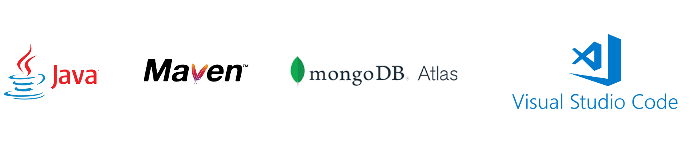

# Library Management System

A simple CLI based Library Management System.

## Tech Stack

**Client:** Java, Maven

**Server:** MonogoDB Atlas



## Team

<table id='team'>
<tr>
<td id='Sagar Paul'>
<a href='https://github.com/sagar-alias-jacky'>

</a>
<h4 align='center'><a href='https://github.com/sagar-alias-jacky'>Sagar Paul</a></h4>
</td>
<td id='Paul G Tharayil'>
<a href='https://github.com/paul1947'>

</a>
<h4 align='center'><a href='https://github.com/paul1947'>Paul G Tharayil</a></h4>
</td>
<td id='Varun C'>
<a href='https://github.com/varunc20101'>

</a>
<h4 align='center'><a href='https://github.com/varunc20101'>Varun C</a></h4>
</td>
<td id='Alston Peter'>
<a href='https://github.com/ALSTON-PETER'>

</a>
<h4 align='center'><a href='https://github.com/ALSTON-PETER'>Alston Peter</a></h4>
</td>
</table>


<!-- Run Locally -->
## Run Locally

Clone the project.

```bash
https://github.com/sagar-alias-jacky/s5_dbms_lab_library_management_system_project.git
```

Go to the project directory.

```bash
cd s5_dbms_lab_library_management_system_project
```

Open the project in Visual Studio Code or any IDE of your choice which supports Java and Maven projects. We will be using Visual Studio Code for this example.

```bash
code .
```

If you don't have Visual Studio Code installed on your machine, install it from the official website.

[https://code.visualstudio.com/](https://code.visualstudio.com/)

Install the following extensions in Visual Studio Code.

[https://marketplace.visualstudio.com/items?itemName=vscjava.vscode-java-pack](https://marketplace.visualstudio.com/items?itemName=vscjava.vscode-java-pack)


Open the Main.java file in the src/main/java/com/example/ folder and change the MongoDB Atlas connection string to your own connection string in line 35. You will require a MongoDB Atlas Account to do so. You can create one on the official website.

[https://www.mongodb.com/atlas/database](https://www.mongodb.com/atlas/database)


After logging into your MongoDB Atlas account, you can get your connection string and understand how to use it, set up a new user and configure access permissions to the database , by following this video:

<!-- <div align="center">
  <a href="https://www.youtube.com/watch?v=GiNMFI8wnIg"></a>
</div> -->

[](https://www.youtube.com/watch?v=GiNMFI8wnIg "Everything Is AWESOME")

Now create a new database in your cluster named 'library_management_system_project'. If you want to name it anything else, be sure to change it in the datbaseName parameter also, in the getDatabase Method call in line 56 in the Main.java file.

Populate your newly created database with the sample collections and documents provided in the resources/MongoDB_Database/ folder. You can later modify these according to your needs.

Now simply run the Main.java file using the Run menu in Visual Studio Code. 

## Feedback and Questions

Have a question, or want to provide feedback? Visit the [Issues Page](https://github.com/github/feedback/discussions/categories/copilot-feedback)
to ask questions, share bugs. For feedback email hexacode007@gmail.com.
